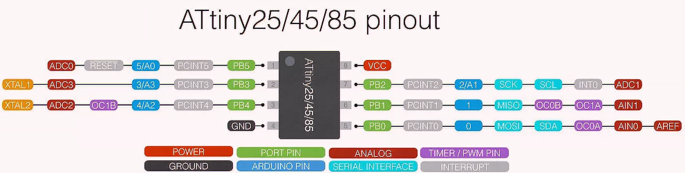
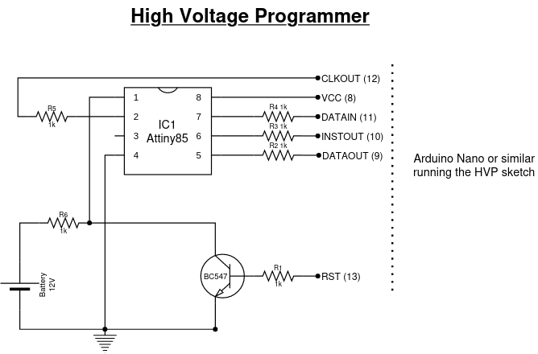
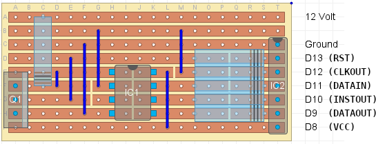
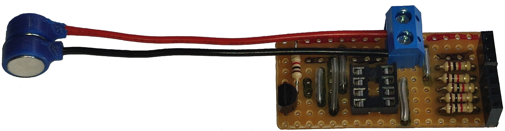
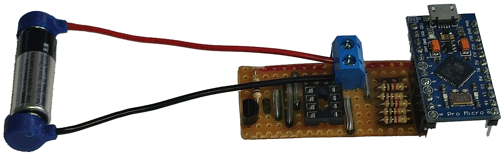
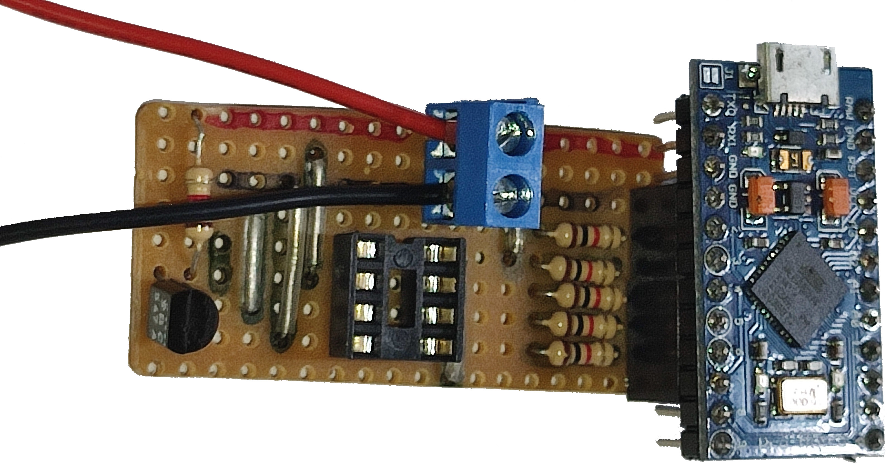

# Resetting Attiny Fuses

**Table of Content**

1. [Introduction](#introduction)
2. [Pin naming conventions](#pin-naming-conventions)
3. [Changing `RESET` to GPIO or back to `RESET`](#changing-reset-to-gpio-or-back-to-reset)
4. [High Voltage Programmer](#high-voltage-programmer)

## Introduction

This section has one purpose: To allow using the `RESET` pin on the Attiny85 as
an additional IO PIN!

Yes, we need a whole section and separate fuse resetter for that! The reason
for this is that the `RESET` pin is needed to program the MCU using the
programmer explained in the [ISP] section, but once you change the `RESET` pin
to be used and an IO, it looses it's `RESET` function!

So, in order to use the `RESET` pin as an IO, but still be able to uploaded
programs to the Attiny85, the following flow is needed:

1. Write your code, but make it such that using Arduino pin 5 (IC pin 1, AVR
   `RESET` function) for IO is not core to the functionality.
2. Upload your code as per the [ISP] flow
3. Test as much as possible, iterating over steps 1 to 3.
4. When all is ready and you now need to bring Pin 5 into the picture as a
   GPIO, upload your final code utilising this pin as GPIO.
5. Change the fuses to disable the chip `RESET` function.
6. Test
    1. If you need to change the code again, use the [HVP] to default the
        fuses back to let the `RESET` function be available again.
    2. Go back to step 1
7. Deploy

This section of the main repo is very much built from the excellent work done
by others. Specifically I have unashamedly copied parts from **Ralp Bacon**'s
repo [ATTiny85_Fuse_Resetter], and also from **E**'s blog around an [HVP] to
reset Attiny fuses.

Many thanks to these guys and all the others that have contributed to their
making their work possible!

## Pin naming conventions

This section deals specifically with the `RESET` pin on the Attiny85.

This is pin 1 on the IC, but is pin 5 in Arduino speak. See the pinout and pin
definitions below.



Anywhere this document refers to either pin 1 (IC) or pin 5 (Arduino), the
reference is to the `RESET` pin.

## Changing `RESET` to GPIO, or back to `RESET`

There are many resources on the internet on this subject, but it basically
boils down to changing a specific fuse setting to remove the `RESET` function
from pin 1 on the MCU, which then allows the pin to be used as a GPIO.

Fuse settings and how to set them are described in the [ISP] section under the
**Info on Fuses** header.

Once you have made this change, and then later need to make the reset
functionality available again to update the program, the rest of this document
applies.

## High Voltage Programmer

To get out of the chicken-and-egg situation of not being able to program or
reset the fuses without the `RESET` functionality, the MCU allows resetting
fuses using a high voltage (12V) on the RESET pin while programming new fuse
settings.

The circuit below (editable with [DrawIO]) should be used to enable this programming to be done.



This comes from the [HVP] site (thanks!) and this site also has a quick circuit
layout to be built on VeroBoard:



I have amended these images to include the pin function names (**RST**,
**CLKOUT**, etc) as used in the [HSV program] that needs to be loaded on
another MCU to write and read the fuses.  
Having these names on the images makes it easier to use different Arduino
compatible MCUs as programmer.

See the [ATTiny85_Fuse_Resetter] pages and linked video to see how Ralph Bacon
made hist board fit into an Uno for example.

I do not have an Uno available, but do have a Pro Micro clone, so mine is made
to work with the Pro Micro. I'm also not adding all the power LED, buzzer and
battery holder like Ralph's because I wanted something simpler and quicker to
build.

I did use his idea for the mini 12V remote controller battery though, but I use
a different connection. See my board below here:





The 12V supply is connected to the terminal block. I use some 3D printed [magnetic battery connectors]
(also available on [Thingiverse] if you do not use [OnShape]), to easily
connect the battery.

Note the Pro Micro fitted into the socket. See below for changing the pin
numbers from the default for an Uno as shown in the circuit, to be compatible
with a Pro Micro to make this configuration possible.

## Programmer code

In order to do the fuse setting or resetting, we need use a specific program on
the programmer MCU (Pro Micro in this case). 

This section of the repo has a [PlatformIO] initialised project for uploading
and using the HVP code. This code has been adapted from [Ralph Bacon's][ATTiny85_Fuse_Resetter]
adaptions of the code from others (lots of history here :-) ) to drive a HVP.

The current version of the source is setup specifically for a Pro Micro as
shown above, while the original intent was for an Uno. Adjusting the code is
fairly easy for any other MCU (Nano, for example) to make it easy to simply
plug the HVP board into another MCU, or the MCU into the HPV board.

The main section in the code for this is as shown below:

```c++
/**
 * The following pins works well with the Pro Micro I use. The programmer board
 * has a set of female connectors added for the programmer interface, and a Pro
 * Micro with male pins can plug directly into the programmer board, lining up
 * on the GND pin.
 **/
#define  RST     2    // Output to level shifter for !RESET from transistor to Pin 1
#define  CLKOUT  3    // Connect to Serial Clock Input (SCI) Pin 2
#define  DATAIN  4    // Connect to Serial Data Output (SDO) Pin 7
#define  INSTOUT 5    // Connect to Serial Instruction Input (SII) Pin 6
#define  DATAOUT 6    // Connect to Serial Data Input (SDI) Pin 5
#define  VCC     7    // Connect to VCC Pin 8
```

The `defines` uses the same names as per the circuit above. Simply find pins on
your MCU that aligns mostly with `GND` and then assign them according to the
names above.

The `platformio.ini` included has environments set for both a Pro Micro (called
`micro`) as well as a Nano (named `nano`). All example in this doc uses the
`micro` environment.

Once you are happy with your pin configs, connect the MCU and upload the sketch
with:

    $ pio run -e micro -t upload

To test that the basics works, connect to the MCU and check the prompts are
there:

    $ pio run -e micro -t monitor

This should give you the prompt as defined in the `promptChoice()` function in
the code, and you can press `1` or `2` to test the functionality without
connecting a battery or Attiny85 yet.

Due to how the reset and boot loader works on the Pro Micro, it does not reset
the MCU on connecting the monitor, so the initial message to switch on the 12V
supply, and instructions on what to do, is not visible.  
This is not a problem since at this point it is waiting for you input. Just
press space and it will print the instructions again.

## Using the HPV to manage the `RESET` pin

Once you are ready to manage the `RESET`, insert the Attiny85 into the socket,
connect to the MCU using:

    $ pio run -e nano -t monitor

As mentioned above, for the Pro Micro, just press space to refresh the prompt.

Next connect the 12V battery, press `1` to enable the fuse for `RESET`
functionality, or press `2` to enable the pin for GPIO.

That's it!

<!--Links -->
[ISP]: ../ISP/
[ATTiny85_Fuse_Resetter]: https://github.com/RalphBacon/ATTiny85_Fuse_Resetter
[HVP]: https://arduinodiy.wordpress.com/2015/05/16/high-voltage-programmingunbricking-for-attiny/
[magnetic battery connectors]: https://cad.onshape.com/documents/8cafe3d96e3cf2e3210c4094/w/bc61aea212ccca67112cd265/e/d06cc2ccbc3a4bd52e9a48d8
[Thingiverse]: https://thingiverse.com
[OnShape]: http://onshape.com
[DrawIO]: https://app.diagrams.net/
[PlatformIO]: https://platformio.org/

