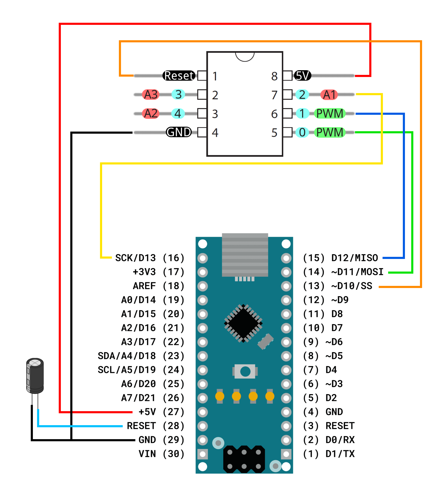

# Programming an Attiny85 using a Nano and PlatformIO

**NOTE**: This repo was cloned from [Dario Casciato]'s excellent work and then
adapted to be more in a style that I like. The text, code, flow, etc. are all
his, with me just making some formatting and directory layouts and some minor
changes here and there. Thanks Dario!

**Table of Content**

1. [Introduction](#introduction)
	1. [Disclaimer](#disclaimer)
2. [Overview](#overview)
3. [1. Set up the Arduino as ISP programmer](#1-set-up-the-arduino-as-isp-programmer)
	1. [Some Notes](#some-notes)
4. [2. Wiring up the Attiny85](#2-wiring-up-the-attiny85)
	1. [Note](#note)
5. [3. PlatformIO setup for Attiny85 programming](#3-platformio-setup-for-attiny85-programming)
	1. [Info on Fuses](#info-on-fuses)
		1. [**CKDIV8**: Divide clock by 8](#ckdiv8-divide-clock-by-8)
		2. [**RSTDISBL**: Disable RESET pin](#rstdisbl-disable-reset-pin)
2. [4. Program it!](#4-program-it)


## Introduction

I think finding out how to program a new microcontroller for the first time
without proper documentation can be one of the most painful tasks in embedded
systems.

This task mostly involves finding YouTube videos that explain almost your case
but not exactly, scrolling through websites and not finding any relevant
information, and finally thinking you found the solution, but then an error
pops up that has never been recorded in human history, so you don't find
anything about it on the web.

That's why I want to close a gap with this article about **how to program an
Attiny85 with an Arduino via [PlatformIO].**

### Disclaimer

This article focuses only on how to program an Attiny85. So it is not a
complete guide on also how to set up and program an Arduino. In this article, I
will do all examples with an Arduino Nano.

## Overview

These are the general steps on how to program the Attiny85:

- Set up the Arduino as ISP programmer
- Wiring up the Attiny85
- Setting up the PlatformIO Project
- Program it!

## 1. Set up the Arduino as ISP programmer

The first step is to modify the Arduino's behavior, transforming it into a
capable ISP (In-System Programmer). This step is relatively simple: you just
need to upload a program to the Arduino. It doesn't matter if you upload the code
with the Arduino IDE or via PlatformIO.

The [1_ISP_Setup] directory contains a base [PlatformIO] setup to write the ISP
code to an Arduinio Nano or clone.

### Some Notes
* There are more than version of bootloader for the Nano. The `platformio.ini`
    setup in [1_ISP_Setup] uses the old Nano bootloader via the
    `nanoatmega328` board. For new bootloader use the `nanoatmega328new` board
    name.
* Any Arduino type board (within reason) can be used as programmer - simply
    modify the config to suite that bord, and match up the correct pins.
* ISP (In-System Programmer) in this case is misleading since you can not
    normally program the Attiny85 in-system, since 4 of the 6 pins are needed
    for programming!

After this is done, you are ready to wire up the Attiny85 to the Nano to upload
code to the Attiny85!

## 2. Wiring up the Attiny85

The wiring requires one additional part: a capacitor with a minimum capacity of
1µF is needed between the Reset and Ground Pin of the Arduino. The capacitor
prevents the Arduino from resetting while programming the Attiny85.

These are the connections:

| Arduino        | Attiny85 |
| -------------- | -------- |
| 5V             | VCC      |
| Ground         | Ground   |
| Digital pin 13 | GPIO 2   |
| Digital pin 12 | GPIO 1   |
| Digital pin 11 | GPIO 0   |
| Digital pin 10 | Reset    |

Here's an illustration of all connections:


[Image Sources]

### Note

Even if there is an Arduino Nano in the illustration, you can use another
Arduino (e.g., Uno, Mega, etc.) as long as you use the same digital Pins
mentioned above.

## 3. PlatformIO setup for Attiny85 programming

Use what ever method you do for setting up a new [PlatformIO] project, and then
adjust the `platformio.ini` to look like the one in the [3_Attiny85_PIO]
directory.

Here is a copy of it:

```ini
; PlatformIO Project Configuration File
;
;   Build options: build flags, source filter
;   Upload options: custom upload port, speed and extra flags
;   Library options: dependencies, extra library storages
;   Advanced options: extra scripting
;
; Please visit documentation for the other options and examples
; https://docs.platformio.org/page/projectconf.html

[env:attiny85]
platform = atmelavr
board = attiny85
framework = arduino
upload_protocol = stk500v1
upload_flags = 
    -b19200
    -P/dev/ttyUSB0
# Setting fuses to disable reset on pin 1 (5 in Arduino speak)
# and disable the clock divide by 8 prescaler.
# See here: https://community.platformio.org/t/attiny-8mhz-wrong-timing-in-delay-fastled-and-neopixel/24992/2
# And here for fuse calcs: https://www.engbedded.com/fusecalc/
#board_fuses.lfuse = 0xE2
#board_fuses.hfuse = 0xDF
#board_fuses.efuse = 0xFF
```
Adjust the port your Nano presets to whatever it is on your system. For me it
is `/dev/ttyUSB0`

### Info on Fuses
The AtmelAVR MCU's uses _fuses_ to set various functions and runtime config for
the MCU.  
This is a topic on it's own an will not be covered here, suffice it to say that
these fuses can be changed by defining which fuses you want to be set, and then
telling `pio` to change the fuses accordingly (this just runs `avrdude` in the
background to do the actual work).

Full details of the fuses are in the datasheet for the MCU, but fortunately
there are some nice sites on the Internet that makes it easy to calculate the
settings required. One such site is the [AVR Fuse Calculator] as noted in the
INI file.

If you need to change any fuses, you calculate the new values, set then as per
the INI above, and then run:

`pio run -t fuses`

using the normal Nano as ISP.

There are two fuses worth mentioning here:

#### **CKDIV8**: Divide clock by 8

This fuse is set by default on a fresh Attiny85 and what it does is to divide
the normal clock by a factor of 8. This means that the MCU runs 8 times slower
than normal and something like `delay(1000)` will not delay for a second, but
rather for 8 seconds.

This can be changed by switching off the fuse that controls this divider.

This fuse is configured with the `lfuse` setting which by default has the value
of `0x62`. By disabling this divider and no other changes, this fuse setting
will be set to `0xE2` as in the INI file above.

Verify this on the [AVR Fuse Calculator]

#### **RSTDISBL**: Disable RESET pin

This fuse allows disabling the `RESET` function on pin 1 of the MCU and allows
this pin to now be used as a general IO pin.

This is great because you now have one extra IO pin,l but there is a caveat:  
Once you disable the `RESET` function, you not program the MCU again using the
ISP programmer we set up here!

This is because the `RESET` function is needed to upload the new code.  
There is a way to recover from this, but requires a [High Voltage Programmer]
to rest the fuse to allow normal programming again. See the [High Voltage
Programmer] repo for details.

This fuse is set in the `hfuse` settings. The default value for this fuse is
`0xDF` as shown above, but using the fuse calcualtor, you will see that
disabling the reset function (and nothing else) changes this value to `0x5F`.

**Warning**: Do **NOT** reset this fuse unless you have a [High Voltage Programmer]
to enable the `RESET` function again!

## 4. Program it!

In the `src` directory, you can find the `main.cpp` with the basic example code
of the Arduino. Write your code into this file, and then you should be able to
upload it.

You can upload it in the PlatformIO tab on the left and click "Upload", or from
the cli with:

`pio run -t upload`

The console output should look something like this:

```
Building in release mode
Checking size .pio\build\program_via_ArduinoISP\firmware.elf
Advanced Memory Usage is available via "PlatformIO Home > Project Inspect"
RAM:   [==        ]  16.4% (used 84 bytes from 512 bytes)
Flash: [==        ]  15.0% (used 1230 bytes from 8192 bytes)
Configuring upload protocol...
AVAILABLE: stk500v1
CURRENT: upload_protocol = stk500v1
Looking for upload port...
Uploading .pio\build\program_via_ArduinoISP\firmware.hex

avrdude: AVR device initialized and ready to accept instructions

Reading | ################################################## | 100% 0.02s

avrdude: Device signature = 0x1e930b (probably t85)
avrdude: erasing chip
avrdude: reading input file ".pio\build\program_via_ArduinoISP\firmware.hex"
avrdude: writing flash (1230 bytes):

Writing | ################################################## | 100% 1.81s

avrdude: 1230 bytes of flash written
avrdude: verifying flash memory against .pio\build\program_via_ArduinoISP\firmware.hex:
avrdude: load data flash data from input file .pio\build\program_via_ArduinoISP\firmware.hex:
avrdude: input file .pio\build\program_via_ArduinoISP\firmware.hex contains 1230 bytes
avrdude: reading on-chip flash data:

Reading | ################################################## | 100% 0.88s

avrdude: verifying ...
avrdude: 1230 bytes of flash verified

avrdude: safemode: Fuses OK (E:FF, H:DF, L:62)

avrdude done.  Thank you.
```

You have successfully programmed your Attiny85!

<!-- Links -->
[Dario Casciato]: https://github.com/DarioCasciato/PlatformIO-Attiny85-Programming-with-Arduino-Nano
[PlatformIO]: https://platformio.org/
[1_ISP_Setup]: ./1_ISP_Setup
[Image Sources]: ./2_Wiring/Sources.txt
[3_Attiny85_PIO]: ./3_Attiny85_PIO
[AVR Fuse Calculator]: https://www.engbedded.com/fusecalc/
[High Voltage Programmer]: ../FuseResetter
